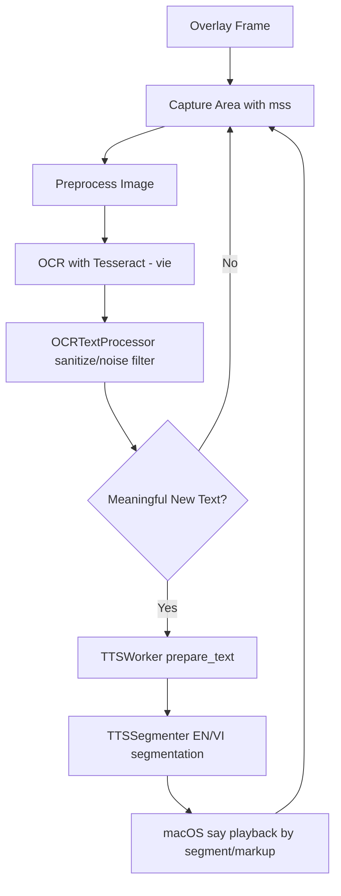

# w3-speak-shot

Desktop app (PyQt5) that:
- captures a selected screen region in real time,
- runs Vietnamese OCR with `tesseract`,
- speaks detected text with macOS `say`,
- auto-detects mixed English/Vietnamese phrases and switches voice per segment.

## System Requirements

- macOS (current TTS backend uses `say`).
- Python 3.10+.
- Tesseract + Vietnamese language data.

```sh
brew install tesseract
brew install tesseract-lang
```

## Installation

```sh
python3 -m venv venv
source venv/bin/activate
pip install -r requirements.txt
```

To enable local language detection with fastText (recommended), make sure the model exists:

```sh
mkdir -p models
curl -L -o models/lid.176.ftz https://dl.fbaipublicfiles.com/fasttext/supervised-models/lid.176.ftz
```

`TTSWorker` searches model paths in this order:
- `W3_TTS_FASTTEXT_MODEL`
- `app/models/lid.176.ftz`
- `app/models/lid.176.bin`
- `models/lid.176.ftz`
- `models/lid.176.bin`

## Run

```sh
python app
```

Or:

```sh
python -m app
```

## Quick Usage

- Move the frame using the top-left square handle.
- Resize using the top-right square handle.
- Bottom-left green square shows capture/running status.
- Bottom-right `X` square closes the app.
- Use the `Options` menu:
  - `Start`
  - `Stop`
  - `Set Speed...`
  - `Close App`

The app persists last window position/size in `app/.overlay_state.json`.

## Workflow



## Source Structure

- `app/__main__.py`: app entrypoint and native menu setup.
- `app/overlay.py`: overlay UI, capture loop, OCR orchestration.
- `app/overlay_text.py`: OCR text normalization, sanitization, noise filtering.
- `app/tts_worker.py`: TTS runtime worker, queue, playback control.
- `app/tts_segmenter.py`: EN/VI detection and segmentation (fastText + rules).
- `app/app_icon.py`: application icon.

## Main Environment Variables

- `W3_TTS_SAY_VOICE` (default: `Linh`): Vietnamese voice.
- `W3_TTS_SAY_EN_VOICE` (default: auto fallback): English voice.
- `W3_TTS_MULTI_VOICE_MODE` (default: `segment`): `segment` or `markup`.
- `W3_TTS_SPELL_ACRONYMS` (default: `1`): spell acronyms (`SDK`, `KMS`, ...).
- `W3_TTS_DETECT_EN_WORDS` (default: `1`): enable English phrase detection (fastText + rules).
- `W3_TTS_DEBUG_LANG` (default: `0`): print language-detection debug logs.
- `W3_TTS_FASTTEXT_MODEL`: custom path to fastText model.
- `W3_TTS_FASTTEXT_EN_THRESHOLD` (default: `0.80`): EN confidence threshold.
- `W3_TTS_FASTTEXT_MARGIN_THRESHOLD` (default: `0.12`): confidence margin.
- `W3_TTS_FASTTEXT_MIN_PHRASE_WORDS` (default: `2`): min words per phrase window.
- `W3_TTS_FASTTEXT_MAX_PHRASE_WORDS` (default: `4`): max words per phrase window.

Example:

```sh
W3_TTS_DEBUG_LANG=1 W3_TTS_SAY_EN_VOICE=Samantha python app
```

## Troubleshooting

- `Voice '...' not found`
  - Check available voices: `say -v ?`
  - Set `W3_TTS_SAY_VOICE` / `W3_TTS_SAY_EN_VOICE` to valid values.

- `TTS language detector: fastText unavailable`
  - Ensure `fasttext-wheel` and `numpy<2` are installed (`requirements.txt`).
  - Verify `lid.176.ftz` exists in one of the supported paths.

- OCR returns noisy text
  - Verify capture region quality, on-screen font clarity, and `tesseract-lang` installation.
