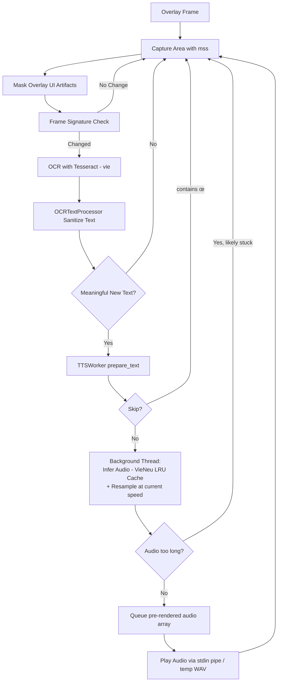

# w3-speak-shot

Desktop app (PyQt5) that:
- captures a selected screen region in real time,
- runs Vietnamese OCR with `tesseract`,
- speaks detected text with VieNeu-TTS (Turbo model — bilingual EN/VI, runs on CPU).

## System Requirements

- Python 3.10+
- [uv](https://docs.astral.sh/uv/)
- Tesseract + Vietnamese language data

```sh
# macOS
brew install tesseract tesseract-lang

# Linux (Ubuntu/Debian)
sudo apt-get install tesseract-ocr tesseract-ocr-vie

# Windows
# Download from https://github.com/UB-Mannheim/tesseract/wiki
```

## Installation

```sh
# Install uv (if not already installed)
curl -LsSf https://astral.sh/uv/install.sh | sh

# Clone the repo
git clone <repo-url>
cd w3-speak-shot

# Create virtual environment and install dependencies
uv venv
uv pip install -r requirements.txt
```

## Run

```sh
# Activate venv then run
source .venv/bin/activate
python app

# Or run directly with uv (no manual activation needed)
uv run python app
```

## Quick Usage

### Overlay controls

| Control | Location | Action |
|---|---|---|
| Move handle | Top-left square | Drag to reposition |
| Resize handle | Top-right square | Drag to resize |
| Status indicator | Bottom-left (●) | Green = running, grey = stopped |
| Start/Stop button | Bottom-left (▶/■) | Toggle capture on/off |
| Skip to latest (>>) | Bottom-left | Drain queue, jump to most recent text |
| Queue count | Bottom-left (number) | Shows pending items in TTS queue |
| Speed down (−) | Bottom-right | Decrease TTS speed by 0.25x |
| Speed up (+) | Bottom-right | Increase TTS speed by 0.25x |
| Speed display | Bottom-right (number) | Shows current TTS speed |
| Close (X) | Bottom-right | Close the app |

### Options menu

- `Start` / `Stop` — begin or stop screen capture and OCR
- `Speed` — adjust TTS playback speed (0.75x – 2x)
- `Auto Speed` — automatically increases speed by +0.25x (max 3.0x) when queue ≥ 2 (default: off). Only affects newly queued items, not items already pre-rendered in queue.
- `Pre-render Audio` — infer + resample audio in background while previous sentence plays, eliminating the gap between sentences (default: on). When off, resample happens at play time — speed changes apply immediately to the next sentence.
- `Close App`

The app persists last window position/size in `app/store/.overlay_state.json`.

## Environment Variables

Copy `.env.example` to `.env` and adjust as needed — it is loaded automatically at startup:

```sh
cp .env.example .env
```

| Variable              | Default | Description                                                          |
| --------------------- | ------- | -------------------------------------------------------------------- |
| `W3_TTS_SPEED_FACTOR` | `1.5`   | Base audio speed-up factor (e.g. `1.0` = normal, `2.0` = 2x faster) |
| `W3_DEBUG_TTS_OUTPUT` | —       | Path to save TTS audio as WAV instead of playing                     |
| `W3_KEEP_TEMP_AUDIO`  | `false` | Keep temp WAV files after playback (Linux: n/a, uses stdin pipe)     |
| `W3_TEMP_AUDIO_DIR`   | sys tmp | Directory for temp WAV files (macOS fallback only)                   |

Variables set in the shell take precedence over `.env`.

## How It Works



## Audio Pipeline

Each sentence goes through a background thread (runs in parallel while previous audio plays):

1. **Inference** — VieNeu TTS generates raw audio, cached by text (LRU, 50 items)
2. **Resample** — speed-up applied at queue time using `scipy.signal.resample`
3. **Queue** — pre-rendered `float32` array stored in playback queue

The `run()` thread dequeues and plays immediately with no additional processing, eliminating the resample gap between sentences.

> **Note:** Speed changes (`+`/`−` buttons or Options menu) only apply to items queued *after* the change. Items already in the queue play at the speed they were rendered at.

## Skip Conditions

The TTS worker silently skips a segment and logs `[SKIP   ]` when:

- The text contains `œ` — indicates garbled/corrupt OCR output.
- The generated audio duration exceeds `max(5.0, len(text) * 0.15)` seconds — indicates the model entered a stuck/looping state.

## Source Structure

```
app/
├── __main__.py       Entry point, PyQt5 app + native menu setup
├── overlay.py        Overlay UI, capture loop, frame change detection, OCR orchestration
├── overlay_text.py   OCR text processor — sanitization, noise filtering, similarity comparison
├── tts_worker.py     TTS worker thread — VieNeu inference, LRU audio cache, playback, speed control
├── audio_player.py   Audio playback — stdin pipe (Linux) or temp file (macOS)
├── audio_utils.py    Shared audio helpers — convert, infer, speed up
└── store/
    ├── logo.icns             App icon (macOS)
    ├── logo.ico              App icon (Windows)
    └── .overlay_state.json   Persisted window position/size
```

## TTS Engine

Uses **VieNeu-TTS Turbo** (`TurboVieNeuTTS`) — GGUF/ONNX format, runs on CPU with a LLaMA backbone.

- Sample rate: 24 000 Hz
- Max context: 4 096 tokens
- Supports bilingual text (English + Vietnamese) without pre-segmentation

## Testing

Generate WAV files from `data/dataset-test.txt` to verify TTS output:

```sh
# Test a single sentence
W3_TTS_SPEED_FACTOR=1.5 uv run test_dataset.py --text "your sentence here"

# Generate one WAV per line → test/001_....wav
W3_TTS_SPEED_FACTOR=1.5 uv run test_dataset.py

# Merge all lines into a single file → test/merged.wav + test/merged_index.txt
W3_TTS_SPEED_FACTOR=1.5 uv run test_dataset.py --merge
```

`merged_index.txt` contains per-segment timestamps for easy audio inspection.

## Troubleshooting

**`TTS initialization error`**
```sh
uv pip install vieneu
```

**No audio output (Linux)**
```sh
# Ensure paplay is available (used for playback via stdin pipe)
sudo apt-get install pulseaudio-utils
```

**OCR returns noisy text**
- Verify capture region quality and on-screen font clarity.
- Ensure `tesseract-lang` (Vietnamese data) is installed.
