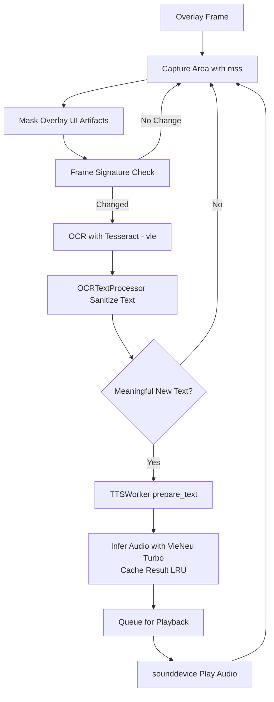

# w3-speak-shot

Desktop app (PyQt5) that:
- captures a selected screen region in real time,
- runs Vietnamese OCR with `tesseract`,
- speaks detected text with VieNeu-TTS (Turbo model — bilingual EN/VI, runs on CPU).

## System Requirements

- Python 3.10+
- [uv](https://docs.astral.sh/uv/)
- Tesseract + Vietnamese language data

```sh
# macOS
brew install tesseract tesseract-lang

# Linux (Ubuntu/Debian)
sudo apt-get install tesseract-ocr tesseract-ocr-vie

# Windows
# Download from https://github.com/UB-Mannheim/tesseract/wiki
```

## Installation

```sh
# Install uv (if not already installed)
curl -LsSf https://astral.sh/uv/install.sh | sh

# Clone the repo
git clone <repo-url>
cd w3-speak-shot

# Create virtual environment and install dependencies
uv venv
uv pip install -r requirements.txt
```

## Run

```sh
# Activate venv then run
source .venv/bin/activate
python app

# Or run directly with uv (no manual activation needed)
uv run python app
```

## Quick Usage

- Move the frame using the **top-left square** handle.
- Resize using the **top-right square** handle.
- **Bottom-left green square** shows capture/running status.
- **Bottom-right `X`** square closes the app.
- Use the `Options` menu:
  - `Start` — begin screen capture and OCR
  - `Stop` — stop capture
  - `Set Speed...` — adjust TTS playback speed
  - `Close App`

The app persists last window position/size in `app/store/.overlay_state.json`.

## Environment Variables

| Variable              | Default | Description                                                    |
| --------------------- | ------- | -------------------------------------------------------------- |
| `W3_TTS_SPEED_FACTOR` | `1.5`   | Audio speed-up factor (e.g. `1.0` = normal, `2.0` = 2x faster) |

```sh
W3_TTS_SPEED_FACTOR=1.2 uv run python app
```

## How It Works



## Source Structure

```
app/
├── __main__.py       Entry point, PyQt5 app + native menu setup
├── overlay.py        Overlay UI, capture loop, frame change detection, OCR orchestration
├── overlay_text.py   OCR text processor — sanitization, noise filtering, similarity comparison
├── tts_worker.py     TTS worker thread — VieNeu inference, LRU audio cache, playback, speed control
└── store/
    ├── logo.icns             App icon (macOS)
    ├── logo.ico              App icon (Windows)
    └── .overlay_state.json   Persisted window position/size
```

## TTS Engine

Uses **VieNeu-TTS Turbo** (`TurboVieNeuTTS`) — GGUF/ONNX format, runs on CPU with a LLaMA backbone.

- Sample rate: 24 000 Hz
- Max context: 4 096 tokens
- Supports bilingual text (English + Vietnamese) without pre-segmentation

## Troubleshooting

**`TTS initialization error`**
```sh
uv pip install vieneu sounddevice
```

**No audio output**
```sh
# Check available audio devices
uv run python -c "import sounddevice; print(sounddevice.query_devices())"
```

**OCR returns noisy text**
- Verify capture region quality and on-screen font clarity.
- Ensure `tesseract-lang` (Vietnamese data) is installed.
